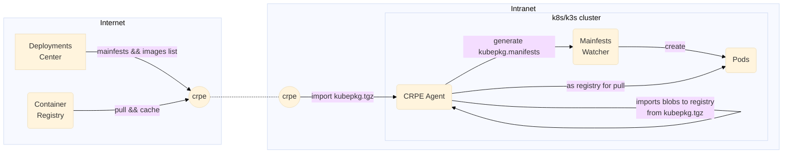

# Container Registry Pocket Edition

[](https://github.com/invertase/melos)

Container pull-only registry on mobile devices



## `kubepkg.tgz`

```
kubepkg.json    
blobs/ # blob contents
  <alg>/
    <hash> 
```

## Spec `kubepkg.json`

```typescript
interface KubePkg {
    apiVersion: "octohelm.tech/v1alpha1"
    kind: "KubePkg"
    metadata: {
        // pkg name 
        name: string
    }
    spec: {
        // semver for upgrade checking
        version: string
        // images with tag may with digest
        // when digest exists, tag the digest instead of pulling always
        images: { [imagetag: string]: string | "" }
        // manifests of k8s
        manifests: {
            // "<metadata.name>.<metadata.namespace>.<kind>"
            [key: string]: {
                apiVersion: string,
                kind: string,
                [x: string]: any
            }
        }
    }
}
```

```json
{
  "apiVersion": "octohelm.tech/v1alpha1",
  "kind": "KubePkg",
  "metadata": {
    "name": "demo"
  },
  "spec": {
    "images": {
      "docker.io/library/nginx:alpine": ""
    },
    "version": "0.0.1",
    "manifests": {
      "web.default.deployment": {
        "apiVersion": "apps/v1",
        "kind": "Deployment",
        "metadata": {
          "name": "web",
          "namespace": "default"
        },
        "spec": {
          "replicas": 1,
          "selector": {
            "matchLabels": {
              "app": "web"
            }
          },
          "template": {
            "metadata": {
              "labels": {
                "app": "web"
              }
            },
            "spec": {
              "containers": [
                {
                  "image": "docker.io/library/nginx:alpine",
                  "imagePullPolicy": "IfNotPresent",
                  "name": "web",
                  "ports": [
                    {
                      "containerPort": 80,
                      "name": "http"
                    },
                    {
                      "containerPort": 443,
                      "name": "https"
                    }
                  ]
                }
              ]
            }
          }
        }
      }
    }
  }
}
```

