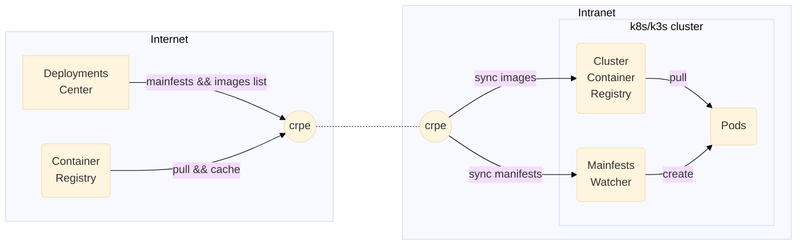

# Container Registry Pocket Edition

Container pull-only registry on mobile devices

```mermaid
%%{init:{'theme':'base'}}%%
flowchart LR
    subgraph internet ["Internet"]
        registry("Container<br>Registry")
        deployment_center["Deployments<br>Center"]
        crpe((crpe))
    end
    
    subgraph intranet ["Intranet"]
        crpe_intranet((crpe))
        
        subgraph cluster ["k8s/k3s cluster"]
            cluster_registry("Cluster<br>Container<br>Registry")
            mainfests_watcher("Mainfests<br>Watcher")
            pods("Pods")
        end
    end
    
    deployment_center -->|"mainfests && images list"| crpe
    registry -->|pull && cache| crpe
    
    crpe -..- crpe_intranet
    
    crpe_intranet 
        -->|sync images| cluster_registry 
        -->|pull| pods
        
    crpe_intranet
        -->|sync manifests| mainfests_watcher    
        -->|create| pods
```