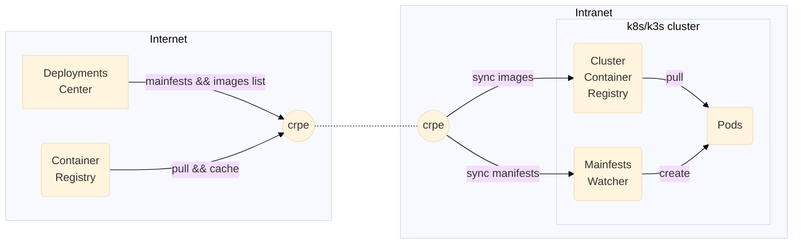

# Container Registry Pocket Edition

[](https://github.com/invertase/melos)


Container pull-only registry on mobile devices



## Spec `KubePkg.json`

```typescript
interface KubePkg {
    // pkg name 
    name: string
    // semver for upgrade checking
    version: string
    // images with tag may with digest
    // when digest exists, tag the digest instead of pulling always
    images: { [imagetag: string]: string | "" }
    // manifests of k8s
    manifests: string[]
}
```

```json
{
  "name": "demo",
  "version": "0.0.1",
  "images": {
    "docker.io/library/nginx:alpine": "sha256:da9c94bec1da829ebd52431a84502ec471c8e548ffb2cedbf36260fd9bd1d4d3",
    "docker.io/querycapistio/proxyv2:1.13.0-distroless": "sha256:5f69524bc2739d87030080adb7508cfe12cbc29ef0936c6d1300c69b31727dbb"
  },
  "manifests": [
  ]
}
```

